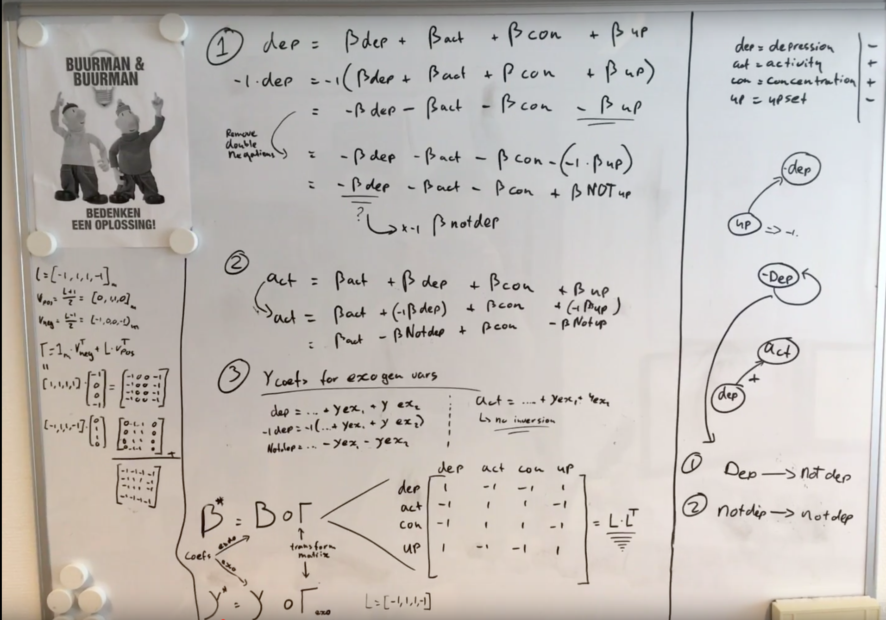

# Doel
Het doel van het omdraaien van een deel van de coëfficiënten in de VAR modellen is om de interpretatie ervan eenvoudiger en duidelijker te maken. In de originele modellen bleek dat het lastig was om positieve verbanden naar een negatieve variabele te begrijpen. Een positief verband was daardoor niet per se iets positiefs. Het was daardoor lastig om een duidelijk overzicht te maken van de verschillen tussen de deelnemers in onze sample. Als voorbeeld, in onze modellen hebben we variabelen als activiteit en stress. Een positief verband van activiteit naar stress zou dan betekenen dat een verhoging in activiteit een verhoging in stress zou betekenen, hoewel deze verhoging niet positief is.

# Procedure
Allereerst maken we een selectie van alle variabelen die positief zouden moeten zijn. Zie de lijst hieronder voor alle variabelen:

- Positive Affect activation    -> blijft hetzelfde
- Positive Affect deactivation  -> blijft hetzelfde
- Negative Affect activation    -> wordt NOT-Negative Affect activation
- Negative Affect deactivation  -> wordt NOT-Negative Affect deactivation
- Activity                      -> blijft hetzelfde
- Upset                         -> wordt NOT-Upset

Dan stellen we een VAR model op op de originele data set (we maken dus geen nieuwe 100-waarde variabelen). Dit resulteert in een VAR model zoals we eerder ook al hadden. De volgende stap is bepalen welke coëfficiënten aangepast moeten worden. Hierin onderscheiden we 3 verschillende mogelijkheden:

1. De coëfficiënten in de formule van een negatieve variabele. Elk van de variabelen in deze set met variabelen die GEEN negatieve variabele is moet omgedraaid worden. De eventuele auto regressieve variabele is een negatieve variabele en moet dus niet omgedraaid worden (eigenlijk zijn het negatieve variabelen, die we omdraaien, en later nog een keer moeten omdraaien omdat ze negatief waren).

2. De coëfficiënten in de formule voor een positieve variabele. In deze functie moeten alleen de negatieve variabelen omgekeerd worden.

3. De coëfficiënten voor de exogene variabelen. Deze variabelen moeten omgedraaid worden in de formule voor een negatieve variabele, maar niet voor een positieve variabele.

# Formule

We nemen voor elk van de variabelen een waarde $\in \{1, -1\}$, 1 als het een positieve variabele is, en -1 als het een negatieve variabele is, en zetten deze in een vector v. V heeft dus lengte n, waar n het aantal endogene variabelen is. Voor de eerdere opsomming zou v dus zijn: $\vec{v} = [1, 1, -1, -1, 1, -1]$. Van deze vector nemen we dan het product met zichzelf getransponeerd om te komen tot een matrix die we piece-wise kunnen vermenigvuldigen met de originele coëfficiënten matrix; $V = \vec{v} * \vec{v}^T$. Voor de exogene variabelen doen we hetzelfde, alleen vermenigvuldigen we hiervoor v met een vector van 1-en, met dezelfde lengte als het aantal exogene variabelen (m). $E = v * 1_m^T$.

